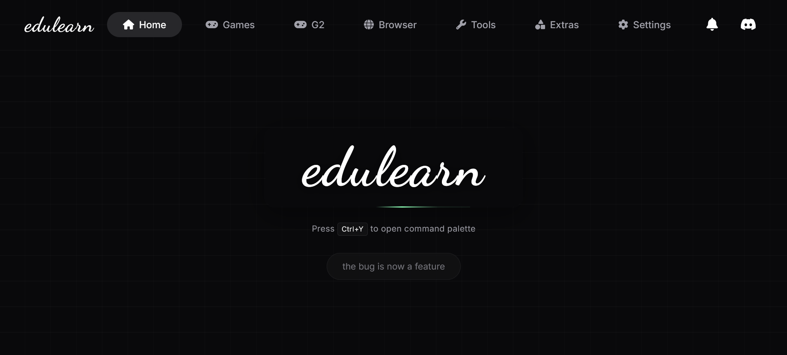

# Edulearn

*Edulearn Lite - The Best Gaming Site.*

---

## What's New

- **Dual Architecture:** A brand new entry point allowing you to choose between **Edulearn Lite** (Streamlined for Gaming) and **EdulearnOS** (Built for Productivity).
- **Extras Hub:** A new integrated dashboard in Lite mode allowing you to launch tools like the Graphing Calculator and Music Player without leaving your current session.
- **Midnight Theme:** A complete visual overhaul featuring deep black backgrounds (`#050505`), crisp white accents, Inter typography, and ambient particle backgrounds.
- **RNG Launcher:** Can't decide? Use the new **"Pick one for me"** button on the selection screen to launch a random environment.
- **Smart Navigation:** Intelligent history handling—going "Back" from the OS or tools returns you to the selection screen instead of kicking you out.
- **Enhanced Info Center:** A beautiful, glassmorphism-based info page with version tracking and visual counters.

---

## Deployment Options

You can deploy Edulearn V9 on multiple static hosting platforms:

  
  
  

Or deploy manually via terminal:  

---

## Discord Server

Join our community for support, updates, and discussions:  

---

## Modes & Features

**Edulearn V5** is split into two distinct experiences to suit your needs:

### ⚡ Edulearn Lite (Default)
*Built for speed, gaming, and quick access tools.*
- **Fullscreen Focus:** No distractions, edge-to-edge content.
- **Extras Hub:** A built-in launcher for utility apps:
    - **Scientific Graphing Calculator:** Plot complex functions with neon visuals.
    - **Music Player:** "Only Lofi-Tunes" & local file support.
    - **Gallery:** Manage saved images and screenshots.
- **Performance:** Optimized for lower-end Chromebooks.
- **Live Counters:** Real-time online user tracking.

### 🖥️ EdulearnOS (Beta)
*Built for multitasking and desktop simulation.*
- **Windowed Interface:** Run multiple apps at once in a desktop environment.
- **Taskbar Navigation:** Classic OS-style start menu and window management.
- **Dual Proxies:** Ultraviolet & Scramjet integration.

---

## Usage

1. **Login:** Search for **"vibecoded"** (case-sensitive) in the fake ClassLink search bar.
   - *Note: Misspelling the password redirects you to the actual ClassLink search page to fool IT staff.*
2. **Select Mode:**
   - Click **Edulearn Lite** for games and tools.
   - Click **EdulearnOS** for the desktop experience.
   - Click **"Pick one for me"** if you're feeling lucky.
3. **Navigation:** Use the sidebar in Lite mode to switch between Home, Games, Extras, and Settings.
4. **Cloaking:** Use the Settings gear icon to change the Tab Title and Favicon (About:Blank cloaking included).

---

## FAQ

**Can I deploy to static hosts?** Yes! Fully optimized for Vercel, Netlify, GitHub Pages, and Cloudflare Pages. Zero backend required.

**How do I get back to the menu?** Simply press your browser's "Back" button. The new navigation logic will take you back to the Version Selection screen safely.

**Is Edulearn safe for school?** Yes. It is designed as a learning hub and unblocking tool.

---

## Credits

- **Vibec3der** – Lead Developer & Creator  
- **Claude, ChatGPT, Gemini** – AI Assistance & Refactoring
- **Conall Sadako** – Main Site Fixer  
- **genizy/breadbb** – GN-Math Library Developer  
- **RHW** – Scramjet-static Integration  
- **Albie** – Main Domain Provider
- **Ultimate games stash** - some games
- **Night Network / AmplifyDev** - CSS taken from popular site service "[Space](https://gointospace.app)"
- **Fern proxy** - CSS taken from site service "[fern](https://fern.best)"

*If we missed you in the credits, feel free to contact vibec3der at `fernproxys3@proton.me`*

**DISCLAIMER:** Send all DMCA requests to **Genizy** (GN-math owner) as the game library is imported directly from their repository.

---
## Upvote Us on [UBGHUB](https://ubghub.org/?site=EdulearnOS)
